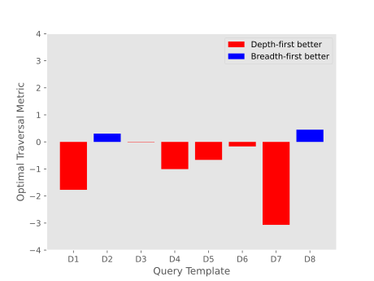
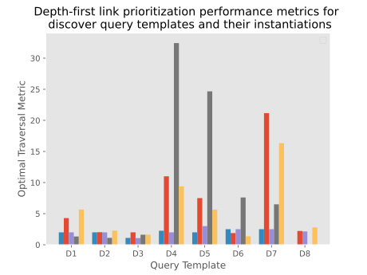
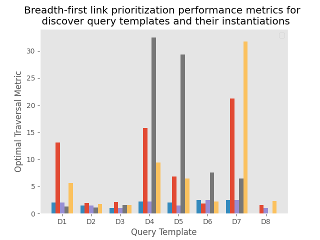

## Results
{:#Results}

{:.comment data-author="BET"} I think the name of the metric should have been introduced earlier.

The differences in computed traversal performance metrics (TPMs) for both depth-first and breadth-first traversal are shown in .
The figure shows that depth-first traversal outperforms breadth-first traversal in algorithmic performance.

However, this trend is not observed when comparing the time until the last query result. 
Additionally, examining the Pearson Correlation Coefficient between the TPM value and the time until the last query result for each traversal strategy reveals a weak negative correlation: -0.156 for breadth-first and -0.175 for depth-first.

This weak correlation, along with the minimal impact of better TPM on execution time, supports the hypothesis that SolidBench Discover queries do not benefit from traversal strategy optimization due to execution being limited by suboptimal query plans .

{:.comment data-author="BET"} Maybe a mention of the results from hartig2016walking should be made. 
If the result of the metric are in adequation with its findings.
Since the two traversal approaches were taken from this paper and from.

{:.comment data-author="BET"} Maybe the times it takes to compute those metric could be interesting, just to give an idea if it is something that you can have on the fly or you must wait a long time to get it, I guess with information about the size of the dataset to put more things into perspective.
Can you provide the source code of the experiment?

<figure id="figure-main">

<figcaption markdown="block">
The difference in the proposed traversal performance metric between depth-first traversal and breadth-first traversal.
</figcaption>
</figure>

<!-- 

<figure id="figure-main">

<figure id="figure-main-1" class="subfigure">

<figcaption markdown="block">
Subfigure 1
</figcaption>
</figure>

<figure id="figure-main-2" class="subfigure">

<figcaption markdown="block">
Subfigure 2
</figcaption>
</figure>

<figcaption markdown="block">
Two figures
</figcaption>
</figure> -->

<!-- 
Figures need a legend for explaining the colors, and descriptions

|      |      D1 |       D2 |       D3 |      D4 |      D5 |      D6 |      D7 |      D8 |
|:-----|--------:|---------:|---------:|--------:|--------:|--------:|--------:|--------:|
| mean | 3.05714 | 1.88286  | 1.48188  | 11.4157 | 8.56275 | 3.16885 | 9.8     | 1.43302 |
| std  | 1.64473 | 0.401009 | 0.352253 | 11.1215 | 8.28228 | 2.25602 | 7.60731 | 1.19184 |

|      |      D1 |       D2 |       D3 |      D4 |       D5 |      D6 |      D7 |       D8 |
|:-----|--------:|---------:|---------:|--------:|---------:|--------:|--------:|---------:|
| mean | 4.82857 | 1.57624  | 1.49423  | 12.4213 |  9.22745 | 3.33612 | 12.8667 | 0.980952 |
| std  | 4.42827 | 0.295887 | 0.393644 | 11.2035 | 10.291   | 2.14421 | 11.643  | 0.905814 |

What are the two tables about?

Are the following enumeration todo's?

1. Computed metric for depth first vs FIFO link prioritisation (possibly with time to compute the metric?)
2. Timing of the two methods to compare correlation between metric and execution time -->
